[ Work in progress ]

# Portfolio 2020

I've built this website as a resume, a port folio of my previous, current and future work. Intended to showcase my work to potential future employers in an environment I purposefully built to display it.

My portfolio was [originally](https://github.com/ChristopherDalziel/Portfolio-2.0) written using static HTML/CSS before I new about the wonders of dynamic websites, React and backends. Rebuilding it has helped me upskill myself further using React, styled css components, Enzyme tests and Firebase.

# Tech

- React
- Redux
- Redux Thunk
- Enzyme
- Firebase [Database, Storage, Auth]
- Axios
- Emotion/core
- Emotion/styled

# Wireframes and Screenshots

## Dashboard

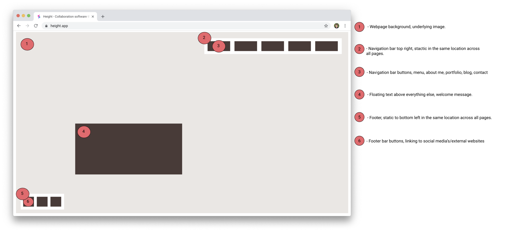

## About Me

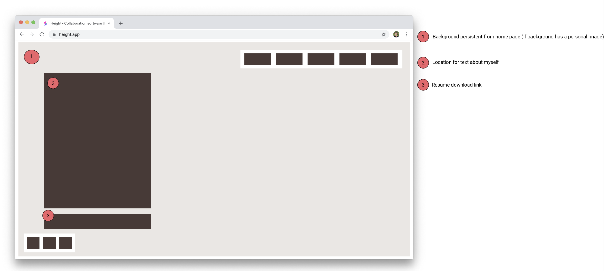
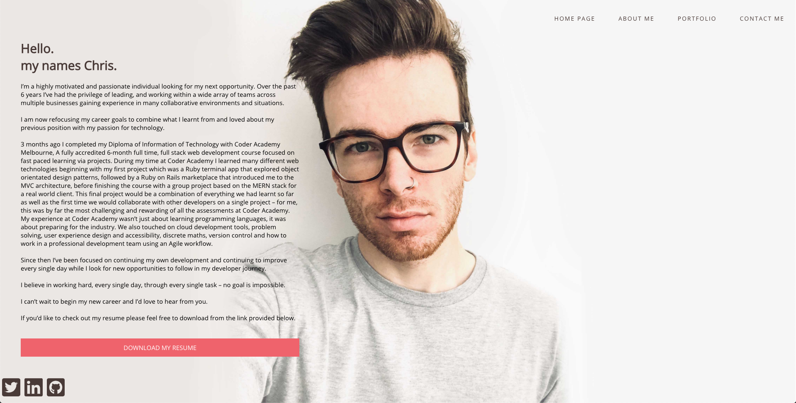

## Portfolio

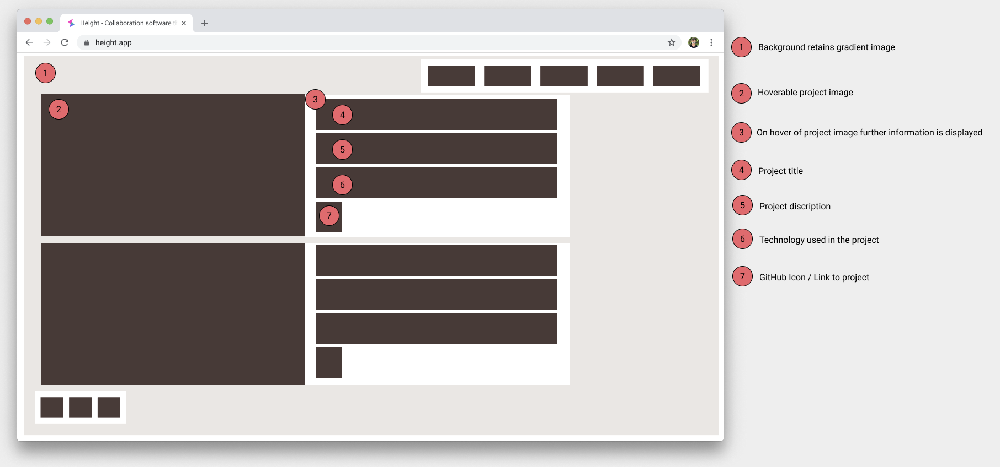
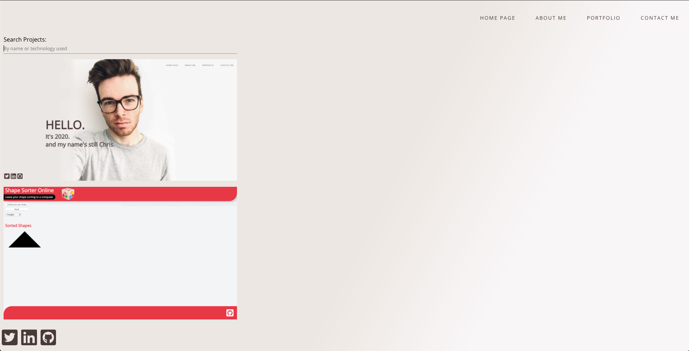

## Create

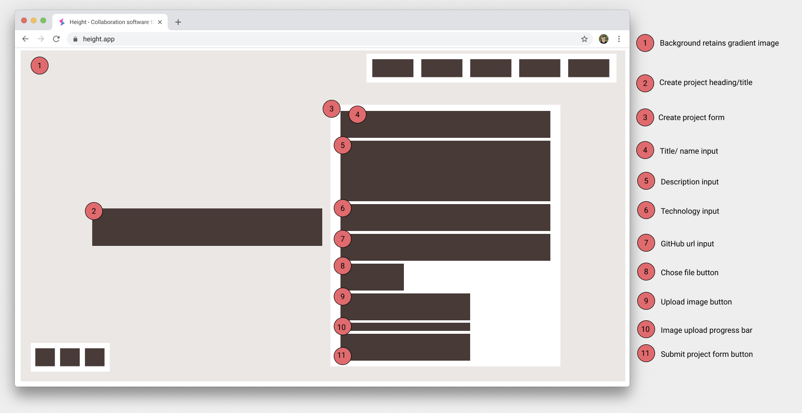
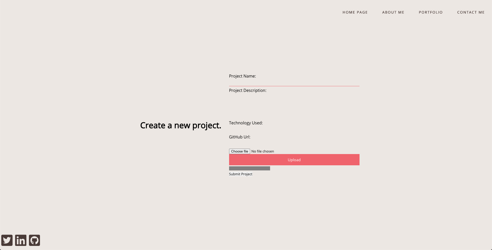

## Contact Me

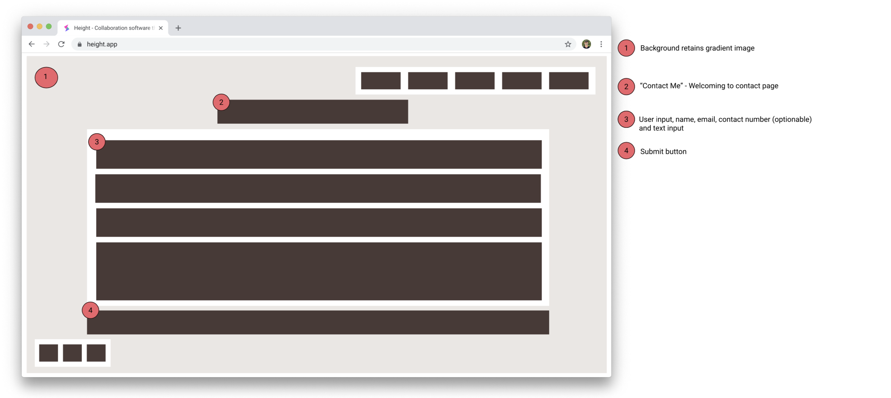
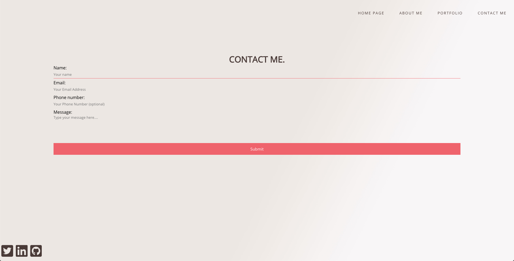

# Colour Pallette

It was important to me to keep a steady flow through the website, after selecting my home page image I wanted everything to be colorized with respect to it. The brown selection of my pallet is actually my hair colour from the background image. I knew I wanted a green and a red, staying with the pastel theme but still having some impact, I used a randomized pallet website to scroll through a bunch of different colours until I found some sets that I liked.
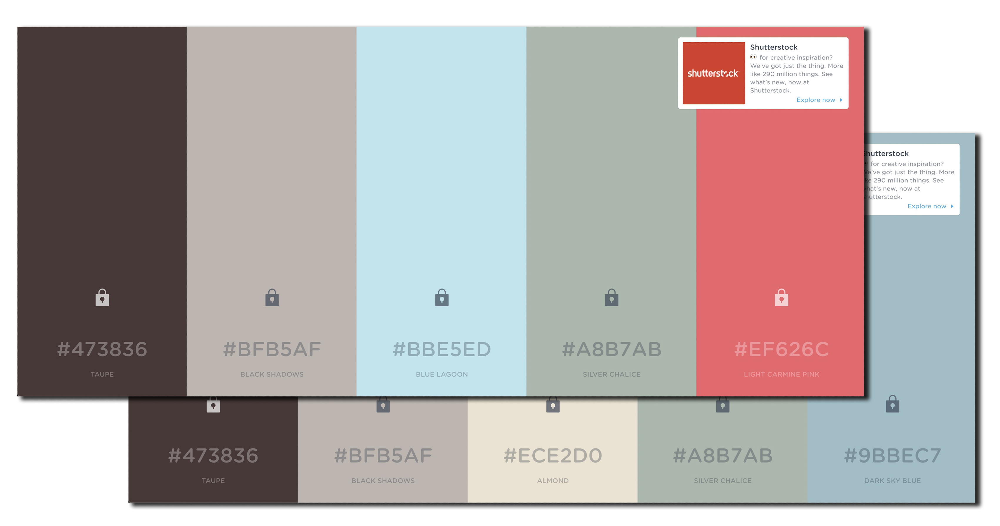

# Commands

- npm install
- npm test
- npm start

# Sitemap

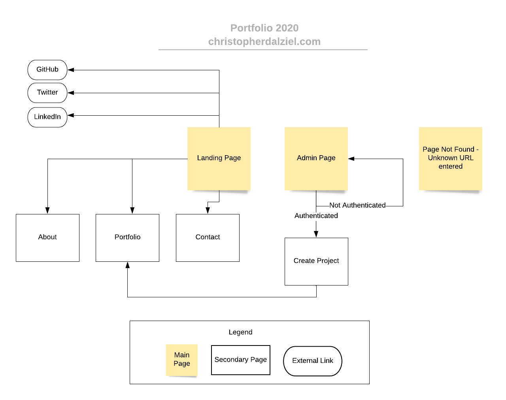
